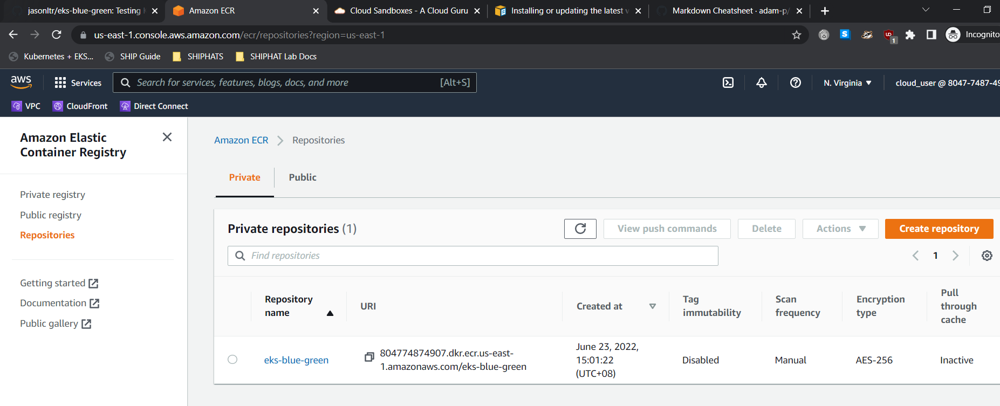
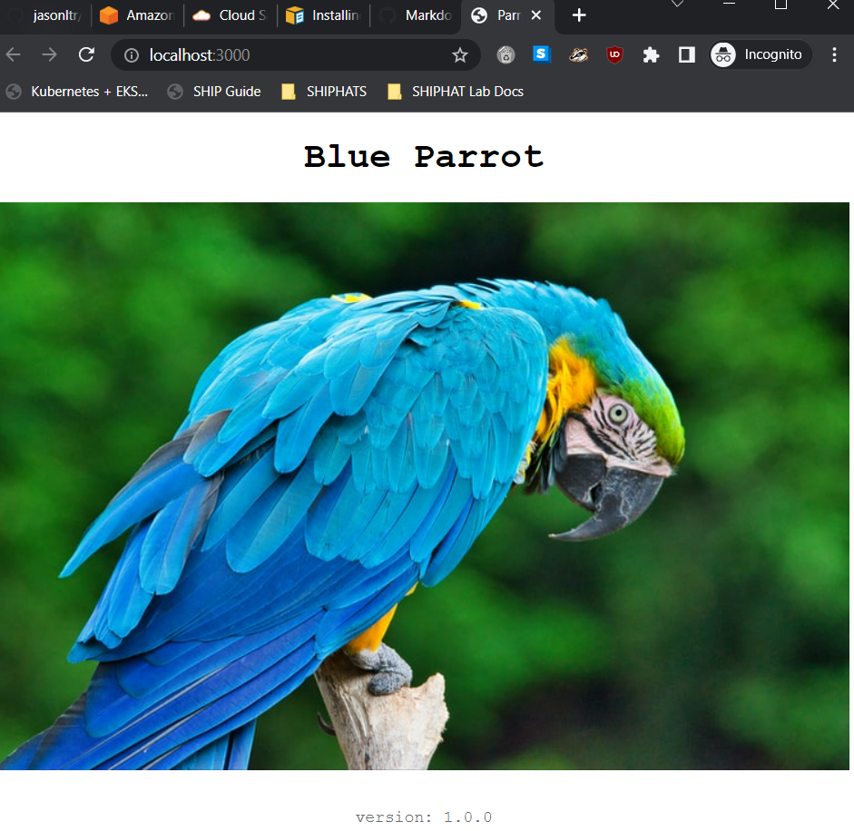
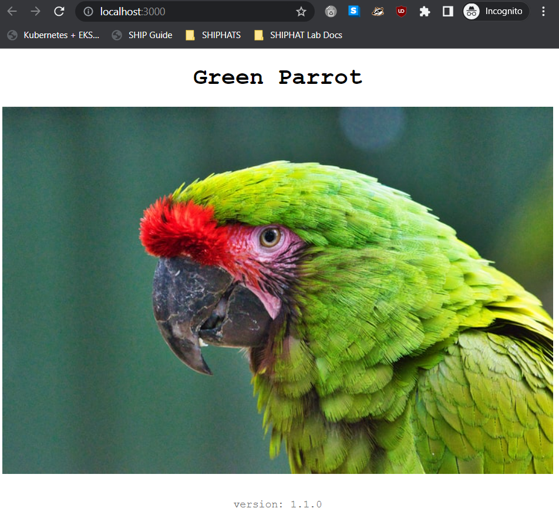
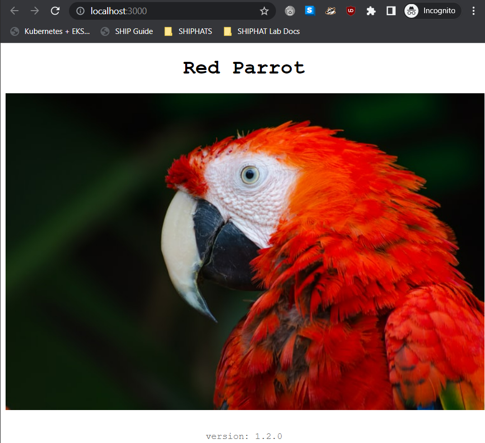
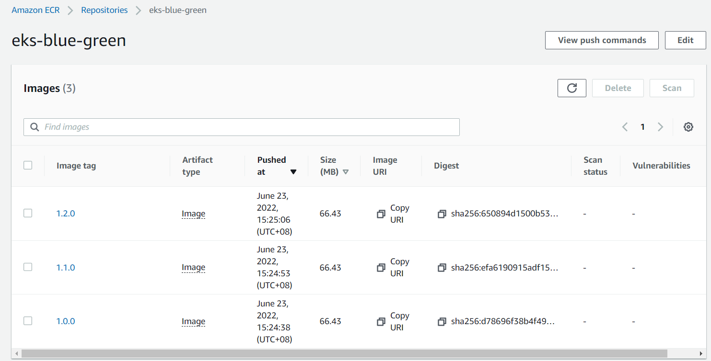
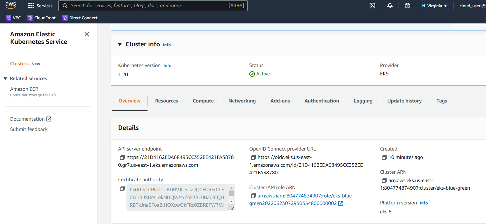
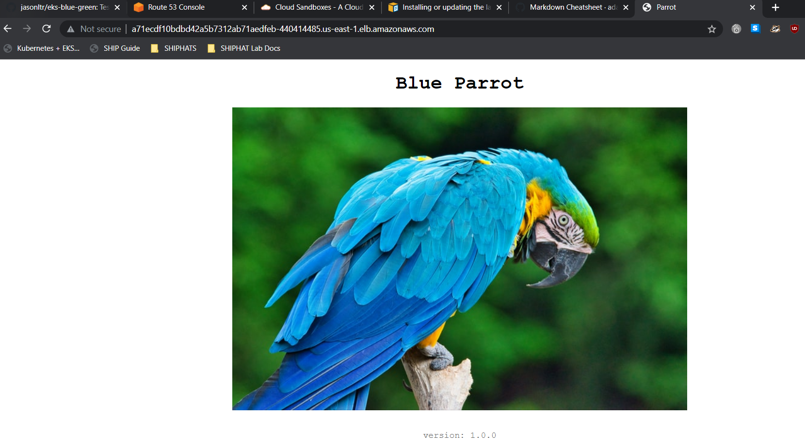
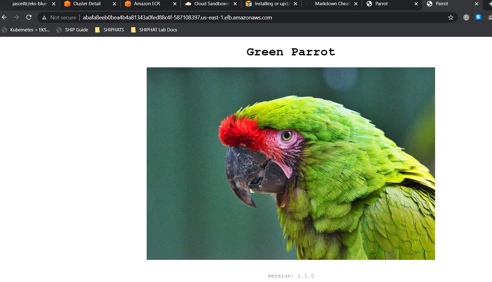

# eks-blue-green 

Testing **Kubernetes Blue/Green Deployment** on **EKS**.


## POC steps ##
Using acloudguru subscription to generate AWS sandbox account  
Download [AWS cli](https://docs.aws.amazon.com/cli/latest/userguide/getting-started-install.html)  
```
jason@DEV-52WP6M3:~/Documents/eks-blue-green$ aws --version
aws-cli/1.25.9 Python/3.8.10 Linux/5.10.16.3-microsoft-standard-WSL2 botocore/1.27.9
```  
update the aws credentials at 
```
jason@DEV-52WP6M3:~/.aws$ cat ~/.aws/credentials
[default]
aws_access_key_id = 
aws_secret_access_key = 
```
Fork this [repo](https://github.com/jeromedecoster/eks-blue-green)  

In terminal, run 
```
export AWS_PROFILE=default \
export AWS_REGION=us-east-1 \
export PROJECT_NAME=eks-blue-green \
export PROJECT_DIR=/home/jason/Documents/eks-blue-green \
export ACCOUNT_ID=804774874907 
```
In the same terminal, we are going to create the ECR  
```
aws ecr create-repository \
    --repository-name $PROJECT_NAME \
    --query 'repository.repositoryUri' \
    --region $AWS_REGION \
    --profile $AWS_PROFILE \
    --output text
```
The URI of the ECR will be output  
```
804774874907.dkr.ecr.us-east-1.amazonaws.com/eks-blue-green
``` 
Verify on console that the repo is created  


cd to website folder and run npm install 
```
jason@DEV-52WP6M3:~/Documents/eks-blue-green$ cd website
jason@DEV-52WP6M3:~/Documents/eks-blue-green/website$ npm install
npm notice created a lockfile as package-lock.json. You should commit this file.
added 61 packages from 44 contributors and audited 61 packages in 2.613s

7 packages are looking for funding
  run `npm fund` for details

found 0 vulnerabilities
```

Test all 3 website versions on local before building docker image  
cd back to folder containing make.sh  
```
jason@DEV-52WP6M3:~/Documents/eks-blue-green$ make local-1.0.0
 EXECUTE  local-1.0.0
Listening on port 3000
```
Go to browser localhost:3000

```
jason@DEV-52WP6M3:~/Documents/eks-blue-green$ make local-1.1.0
 EXECUTE  local-1.1.0
Listening on port 3000
```

```
jason@DEV-52WP6M3:~/Documents/eks-blue-green$ make local-1.2.0
 EXECUTE  local-1.2.0
Listening on port 3000
```


Now build them into images

```
jason@DEV-52WP6M3:~/Documents/eks-blue-green$ make build-all
 EXECUTE  build-all
 BUILD  eks-blue-green:1.0.0
[+] Building 23.6s (14/14) FINISHED 
```
```
jason@DEV-52WP6M3:~/Documents/eks-blue-green$ docker images
REPOSITORY       TAG       IMAGE ID       CREATED      SIZE
eks-blue-green   1.0.0     f9267d408310   8 days ago   181MB
eks-blue-green   1.1.0     21917d5201f7   8 days ago   181MB
eks-blue-green   1.2.0     3f98e52a752b   8 days ago   181MB
```
Now push those images into the ECR we created previously  
```
Enter ECR URI in build-all.sh
jason@DEV-52WP6M3:~/Documents/eks-blue-green$ make push-all
 EXECUTE  push-all
Login Succeeded
 PUSH  804774874907.dkr.ecr.us-east-1.amazonaws.com/eks-blue-green:1.0.0
The push refers to repository [804774874907.dkr.ecr.us-east-1.amazonaws.com/eks-blue-green]
6be6a7ec3a53: Pushed 
331537cf6f03: Pushed 
e116851fb25d: Pushed 
89df324c9c46: Pushed 
10813fee7dec: Pushed 
1bf8766df00f: Pushed 
f0e175543408: Pushed 
764055ebc9a7: Pushed 
1.0.0: digest: sha256:d78696f38b4f497ac08c741aa5cfcd21c19e040ce566f6d974912cdb967f3613 size: 1995
 PUSH  804774874907.dkr.ecr.us-east-1.amazonaws.com/eks-blue-green:1.1.0
The push refers to repository [804774874907.dkr.ecr.us-east-1.amazonaws.com/eks-blue-green]
6be6a7ec3a53: Layer already exists 
331537cf6f03: Layer already exists 
e116851fb25d: Layer already exists 
89df324c9c46: Layer already exists 
10813fee7dec: Layer already exists 
1bf8766df00f: Layer already exists 
f0e175543408: Layer already exists 
764055ebc9a7: Layer already exists 
1.1.0: digest: sha256:efa6190915adf15edeb3f65edddc251bcb0621c946ccc44b6775e316c1190591 size: 1995
 PUSH  804774874907.dkr.ecr.us-east-1.amazonaws.com/eks-blue-green:1.2.0
The push refers to repository [804774874907.dkr.ecr.us-east-1.amazonaws.com/eks-blue-green]
6be6a7ec3a53: Layer already exists 
331537cf6f03: Layer already exists 
e116851fb25d: Layer already exists 
89df324c9c46: Layer already exists 
10813fee7dec: Layer already exists 
1bf8766df00f: Layer already exists 
f0e175543408: Layer already exists 
764055ebc9a7: Layer already exists 
1.2.0: digest: sha256:650894d1500b539d671486aadbeb5ea3a155a1024ba85573079728391a39c201 size: 1995
```
Check console that images have been pushed



Now we create the EKS cluster using terraform  
Install v0.14 for the purpose of this tutorial, we don't want to modify too much of the code/syntax
```
sudo apt-get install terraform=0.14
jason@DEV-52WP6M3:~/Documents/eks-blue-green$ terraform -version
Terraform v0.14.0
```
cd to infra and run  
terraform init  
terraform fmt -recursive  
terraform validate  
terraform plan  
terraform apply -auto-approve  
This will take some time, once done verify on aws console  
```
Apply complete! Resources: 52 added, 0 changed, 0 destroyed.

Outputs:

cluster_endpoint = "https://21D4162EDA68495CC352EE421FA38780.gr7.us-east-1.eks.amazonaws.com"
cluster_id = "eks-blue-green"
cluster_name = "eks-blue-green"
cluster_security_group_id = "sg-002927f01e3a69cb4"
config_map_aws_auth = [
...
```


Add the cluster to kube config  
```
jason@DEV-52WP6M3:~/Documents/eks-blue-green/infra$ aws eks update-kubeconfig         --name eks-blue-green         --region us-east-1 
Added new context arn:aws:eks:us-east-1:804774874907:cluster/eks-blue-green to /home/jason/.kube/config
jason@DEV-52WP6M3:~/Documents/eks-blue-green/infra$ kubectl config current-context
arn:aws:eks:us-east-1:804774874907:cluster/eks-blue-green
jason@DEV-52WP6M3:~/Documents/eks-blue-green/infra$ kubectl get ns
NAME              STATUS   AGE
default           Active   6m7s
kube-node-lease   Active   6m9s
kube-public       Active   6m9s
kube-system       Active   6m9s
```
Now we wil deploy blue service blue image/container
cd to foler with make.sh
run make k8s-1.0.0  
```
jason@DEV-52WP6M3:~/Documents/eks-blue-green$ make k8s-1.0.0
 EXECUTE  k8s-1.0.0
namespace/eks-blue-green created
 DOCKER_IMAGE  046139891504.dkr.ecr.us-east-1.amazonaws.com/eks-blue-green:1.0.0
 LABEL_VERSION  1-0-0
deployment.apps/parrot-1-0-0 created
service/parrot created
 LOAD_BALANCER  a71ecdf10bdbd42a5b7312ab71aedfeb-440414485.us-east-1.elb.amazonaws.com
```


Now we will deploy green service green image/container
run make k8s-1.1.0-green
```
jason@DEV-52WP6M3:~/Documents/eks-blue-green$ make k8s-1.1.0-green
 EXECUTE  k8s-1.1.0-green
 DOCKER_IMAGE  804774874907.dkr.ecr.us-east-1.amazonaws.com/eks-blue-green:1.1.0
 LABEL_VERSION  1-1-0
deployment.apps/parrot-1-1-0 created
service/parrot-green created
 LOAD_BALANCER  abafa8eeb0bea4b4a81343a0fed88c4f-587108397.us-east-1.elb.amazonaws.com
```


So now we have two load balancers running  
```
jason@DEV-52WP6M3:~/Documents/eks-blue-green$ kubectl get all --namespace eks-blue-green -o=wide
NAME                                READY   STATUS    RESTARTS   AGE   IP           NODE                        NOMINATED NODE   READINESS GATES
pod/parrot-1-0-0-6d7c54cb69-7vjbf   1/1     Running   0          27m   10.0.2.66    ip-10-0-2-53.ec2.internal   <none>           <none>
pod/parrot-1-0-0-6d7c54cb69-p9dsg   1/1     Running   0          27m   10.0.3.184   ip-10-0-3-98.ec2.internal   <none>           <none>
pod/parrot-1-1-0-77c4d79645-6ghzx   1/1     Running   0          23m   10.0.3.154   ip-10-0-3-98.ec2.internal   <none>           <none>
pod/parrot-1-1-0-77c4d79645-dkqzn   1/1     Running   0          23m   10.0.2.169   ip-10-0-2-53.ec2.internal   <none>           <none>

NAME                   TYPE           CLUSTER-IP       EXTERNAL-IP                                                              PORT(S)        AGE   SELECTOR
service/parrot         LoadBalancer   172.20.214.163   a71ecdf10bdbd42a5b7312ab71aedfeb-440414485.us-east-1.elb.amazonaws.com   80:32337/TCP   30m   app=parrot,version=1-0-0
service/parrot-green   LoadBalancer   172.20.29.55     abafa8eeb0bea4b4a81343a0fed88c4f-587108397.us-east-1.elb.amazonaws.com   80:32483/TCP   23m   app=parrot,version=1-1-0

NAME                           READY   UP-TO-DATE   AVAILABLE   AGE   CONTAINERS   IMAGES                                                              SELECTOR
deployment.apps/parrot-1-0-0   2/2     2            2           30m   parrot       804774874907.dkr.ecr.us-east-1.amazonaws.com/eks-blue-green:1.0.0   app=parrot,version=1-0-0
deployment.apps/parrot-1-1-0   2/2     2            2           23m   parrot       804774874907.dkr.ecr.us-east-1.amazonaws.com/eks-blue-green:1.1.0   app=parrot,version=1-1-0
```
We can tell which service is hitting which container via the selector defined in the k8s yaml files  
for BSBC - we ran service.yaml -> deployment.yaml and pass in ${LABEL_VERSION}  
for GSGC - we ran service-green.yaml -> deployment.yaml and pass in ${LABEL_VERSION}  

Now we can try switching blue service to hit green image/container BSGC  
For this we only need to run the service.yaml and pass in the ${LABEL_VERSION} of green container  
```
jason@DEV-52WP6M3:~/Documents/eks-blue-green$ make k8s-1.1.0
 EXECUTE  k8s-1.1.0
 LABEL_VERSION  1-1-0
service/parrot configured
```
```
jason@DEV-52WP6M3:~/Documents/eks-blue-green$ kubectl get all --namespace eks-blue-green -o=wide
NAME                                READY   STATUS    RESTARTS   AGE   IP           NODE                        NOMINATED NODE   READINESS GATES
pod/parrot-1-0-0-6d7c54cb69-7vjbf   1/1     Running   0          46m   10.0.2.66    ip-10-0-2-53.ec2.internal   <none>           <none>
pod/parrot-1-0-0-6d7c54cb69-p9dsg   1/1     Running   0          46m   10.0.3.184   ip-10-0-3-98.ec2.internal   <none>           <none>
pod/parrot-1-1-0-77c4d79645-6ghzx   1/1     Running   0          42m   10.0.3.154   ip-10-0-3-98.ec2.internal   <none>           <none>
pod/parrot-1-1-0-77c4d79645-dkqzn   1/1     Running   0          42m   10.0.2.169   ip-10-0-2-53.ec2.internal   <none>           <none>

NAME                   TYPE           CLUSTER-IP       EXTERNAL-IP                                                              PORT(S)        AGE   SELECTOR
service/parrot         LoadBalancer   172.20.214.163   a71ecdf10bdbd42a5b7312ab71aedfeb-440414485.us-east-1.elb.amazonaws.com   80:32337/TCP   49m   app=parrot,version=1-1-0
service/parrot-green   LoadBalancer   172.20.29.55     abafa8eeb0bea4b4a81343a0fed88c4f-587108397.us-east-1.elb.amazonaws.com   80:32483/TCP   42m   app=parrot,version=1-1-0

NAME                           READY   UP-TO-DATE   AVAILABLE   AGE   CONTAINERS   IMAGES                                                              SELECTOR
deployment.apps/parrot-1-0-0   2/2     2            2           49m   parrot       804774874907.dkr.ecr.us-east-1.amazonaws.com/eks-blue-green:1.0.0   app=parrot,version=1-0-0
deployment.apps/parrot-1-1-0   2/2     2            2           42m   parrot       804774874907.dkr.ecr.us-east-1.amazonaws.com/eks-blue-green:1.1.0   app=parrot,version=1-1-0
```
Now blue service is pointing to green image/container/pod via the selector  
Green still pointing to green  
Check both loadbalancer, both should show green parrot  
  

So this is the main concept of this lab, to set up the cluster such that dev can switch production environment images to new images with virtually 0 downtime  
Now we will try changing green service to blue container  

I run the service-green.yaml but pass in  
```
jason@DEV-52WP6M3:~/Documents/eks-blue-green/k8s$ export DOCKER_IMAGE=$REPOSITORY_URI:1.0.0
jason@DEV-52WP6M3:~/Documents/eks-blue-green/k8s$ export LABEL_VERSION=1-0-0
jason@DEV-52WP6M3:~/Documents/eks-blue-green/k8s$ envsubst < deployment.yaml | kubectl apply --filename -
deployment.apps/parrot-1-0-0 unchanged
jason@DEV-52WP6M3:~/Documents/eks-blue-green/k8s$ envsubst < service-green.yaml | kubectl apply --filename -
service/parrot-green configured
```
```
jason@DEV-52WP6M3:~/Documents/eks-blue-green/k8s$ kubectl get all --namespace eks-blue-green -o=wide
NAME                                READY   STATUS    RESTARTS   AGE   IP           NODE                        NOMINATED NODE   READINESS GATES
pod/parrot-1-0-0-6d7c54cb69-7vjbf   1/1     Running   0          56m   10.0.2.66    ip-10-0-2-53.ec2.internal   <none>           <none>
pod/parrot-1-0-0-6d7c54cb69-p9dsg   1/1     Running   0          56m   10.0.3.184   ip-10-0-3-98.ec2.internal   <none>           <none>
pod/parrot-1-1-0-77c4d79645-6ghzx   1/1     Running   0          52m   10.0.3.154   ip-10-0-3-98.ec2.internal   <none>           <none>
pod/parrot-1-1-0-77c4d79645-dkqzn   1/1     Running   0          52m   10.0.2.169   ip-10-0-2-53.ec2.internal   <none>           <none>

NAME                   TYPE           CLUSTER-IP       EXTERNAL-IP                                                              PORT(S)        AGE   SELECTOR
service/parrot         LoadBalancer   172.20.214.163   a71ecdf10bdbd42a5b7312ab71aedfeb-440414485.us-east-1.elb.amazonaws.com   80:32337/TCP   59m   app=parrot,version=1-1-0
service/parrot-green   LoadBalancer   172.20.29.55     abafa8eeb0bea4b4a81343a0fed88c4f-587108397.us-east-1.elb.amazonaws.com   80:32483/TCP   52m   app=parrot,version=1-0-0

NAME                           READY   UP-TO-DATE   AVAILABLE   AGE   CONTAINERS   IMAGES                                                              SELECTOR
deployment.apps/parrot-1-0-0   2/2     2            2           59m   parrot       804774874907.dkr.ecr.us-east-1.amazonaws.com/eks-blue-green:1.0.0   app=parrot,version=1-0-0
deployment.apps/parrot-1-1-0   2/2     2            2           52m   parrot       804774874907.dkr.ecr.us-east-1.amazonaws.com/eks-blue-green:1.1.0   app=parrot,version=1-1-0
```  
Observe now the deployment is BSGC and GSBC
  

After the initial deployment of BSBC and GSGC, switch to BSGC, blue container should be deleted to save resources  
To verify this, selector for both service should be the same (app=parrot,version=1-1-0) in this case  

Switch back to GSGC first  
```
jason@DEV-52WP6M3:~/Documents/eks-blue-green$ make k8s-1.1.0-green
 EXECUTE  k8s-1.1.0-green
 DOCKER_IMAGE  804774874907.dkr.ecr.us-east-1.amazonaws.com/eks-blue-green:1.1.0
 LABEL_VERSION  1-1-0
deployment.apps/parrot-1-1-0 unchanged
service/parrot-green configured
 LOAD_BALANCER  abafa8eeb0bea4b4a81343a0fed88c4f-587108397.us-east-1.elb.amazonaws.com
```

```
jason@DEV-52WP6M3:~/Documents/eks-blue-green$ kubectl get all --namespace eks-blue-green -o=wide
NAME                                READY   STATUS    RESTARTS   AGE   IP           NODE                        NOMINATED NODE   READINESS GATES
pod/parrot-1-0-0-6d7c54cb69-7vjbf   1/1     Running   0          66m   10.0.2.66    ip-10-0-2-53.ec2.internal   <none>           <none>
pod/parrot-1-0-0-6d7c54cb69-p9dsg   1/1     Running   0          66m   10.0.3.184   ip-10-0-3-98.ec2.internal   <none>           <none>
pod/parrot-1-1-0-77c4d79645-6ghzx   1/1     Running   0          63m   10.0.3.154   ip-10-0-3-98.ec2.internal   <none>           <none>
pod/parrot-1-1-0-77c4d79645-dkqzn   1/1     Running   0          63m   10.0.2.169   ip-10-0-2-53.ec2.internal   <none>           <none>

NAME                   TYPE           CLUSTER-IP       EXTERNAL-IP                                                              PORT(S)        AGE   SELECTOR
service/parrot         LoadBalancer   172.20.214.163   a71ecdf10bdbd42a5b7312ab71aedfeb-440414485.us-east-1.elb.amazonaws.com   80:32337/TCP   69m   app=parrot,version=1-1-0
service/parrot-green   LoadBalancer   172.20.29.55     abafa8eeb0bea4b4a81343a0fed88c4f-587108397.us-east-1.elb.amazonaws.com   80:32483/TCP   63m   app=parrot,version=1-1-0

NAME                           READY   UP-TO-DATE   AVAILABLE   AGE   CONTAINERS   IMAGES                                                              SELECTOR
deployment.apps/parrot-1-0-0   2/2     2            2           69m   parrot       804774874907.dkr.ecr.us-east-1.amazonaws.com/eks-blue-green:1.0.0   app=parrot,version=1-0-0
deployment.apps/parrot-1-1-0   2/2     2            2           63m   parrot       804774874907.dkr.ecr.us-east-1.amazonaws.com/eks-blue-green:1.1.0   app=parrot,version=1-1-0
```
Check selector for both service, they are indeed both green  
To save resources, now we delete blue pods and green service
```
jason@DEV-52WP6M3:~/Documents/eks-blue-green$ kubectl delete deployments parrot-1-0-0 --namespace eks-blue-green
deployment.apps "parrot-1-0-0" deleted
jason@DEV-52WP6M3:~/Documents/eks-blue-green$ kubectl delete services parrot-green --namespace eks-blue-green
service "parrot-green" deleted
jason@DEV-52WP6M3:~/Documents/eks-blue-green$ kubectl get all --namespace eks-blue-green -o=wide
NAME                                READY   STATUS    RESTARTS   AGE   IP           NODE                        NOMINATED NODE   READINESS GATES
pod/parrot-1-1-0-77c4d79645-6ghzx   1/1     Running   0          68m   10.0.3.154   ip-10-0-3-98.ec2.internal   <none>           <none>
pod/parrot-1-1-0-77c4d79645-dkqzn   1/1     Running   0          68m   10.0.2.169   ip-10-0-2-53.ec2.internal   <none>           <none>

NAME             TYPE           CLUSTER-IP       EXTERNAL-IP                                                              PORT(S)        AGE   SELECTOR
service/parrot   LoadBalancer   172.20.214.163   a71ecdf10bdbd42a5b7312ab71aedfeb-440414485.us-east-1.elb.amazonaws.com   80:32337/TCP   74m   app=parrot,version=1-1-0

NAME                           READY   UP-TO-DATE   AVAILABLE   AGE   CONTAINERS   IMAGES                                                              SELECTOR
deployment.apps/parrot-1-1-0   2/2     2            2           68m   parrot       804774874907.dkr.ecr.us-east-1.amazonaws.com/eks-blue-green:1.1.0   app=parrot,version=1-1-0
```


